Winkle 

The title of this project is “Winkle”.
Product Description and Features
Winkle is a social media platform for sharing pictures and videos. It enables you to develop and share your pictures, stories, and videos with the following and friends that matter to you. The Winkle app includes simple features like users can simply follow and unfollow other friends or users according to their desire. In addition to this, users can also add a comment to the post shared by others and react like or dislike it according to their interests. Users will also get an option to save a post by clicking on the save button. However, the most important part is the user can simply search any places or users by typing a random text on the provided search bar. Furthermore, a recommendation part is also done where contents are recommended to the user on the basis of most watch content. 

Technologies used
Flutter
Flutter is an open-source platform used for building applications for mobile, desktop, and web by using a single code base. Flutter is used to build the Winkle app because once developers write code it can be implemented on all the platforms easily. To illustrate iOS, Android, Wear OS, and many more.

MongoDB
Since this social media app deals with a huge amount of data it would be tuff for a relational database RDBMS to handle those data. In order to perfectly manages a large volume of data a NoSQL database is used which is MongoDB.

NodeJS
The widespread task in apps like reading and writing to the network connections as well as reading and writing to the database and file system executes at a very high speed when using NodeJS. Similarly, Node.js code written for either the browser or server runs in a similar manner on both.
 
Figure 1: Login Page

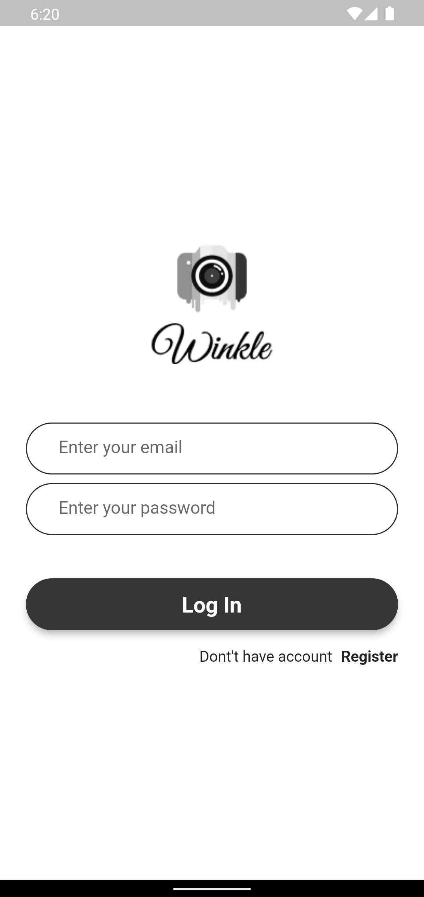

 
Figure 2:Register Page
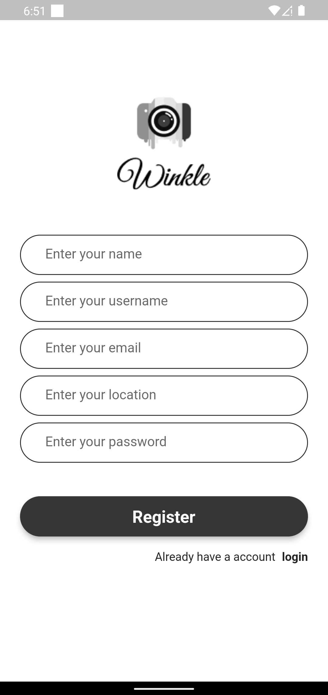

 
Figure 3: feed screen
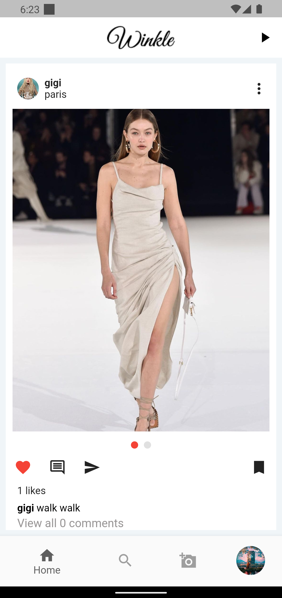

 
Figure 4:when unautherized user click on post option
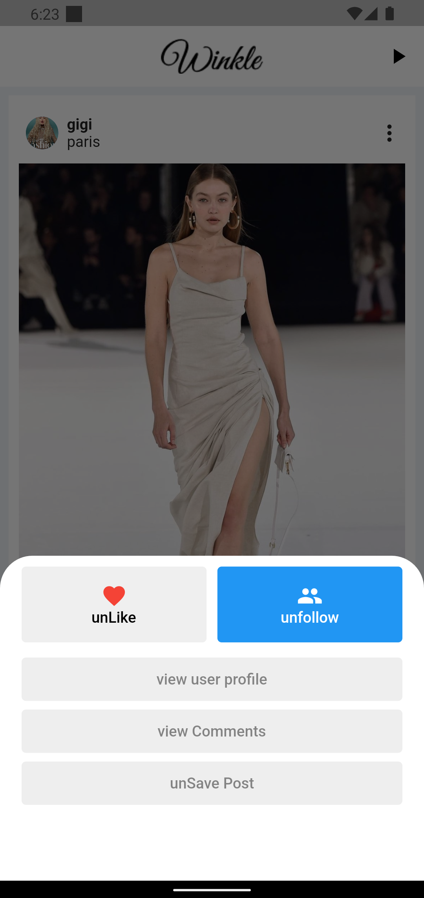

 
Figure 5:when author of the post clicks on post
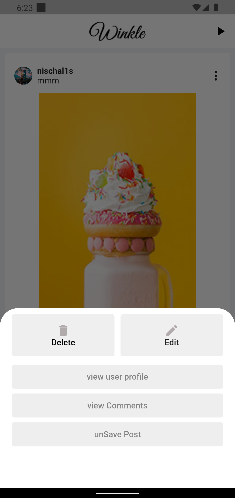

 
Figure 6: Comment section of the post
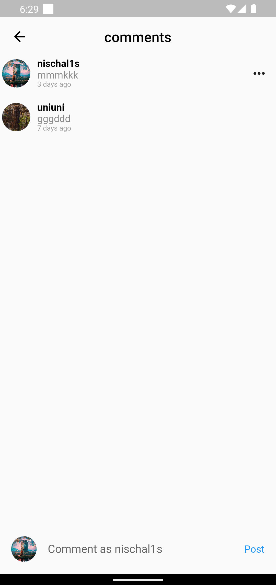

 
Figure 7:Shorts Screen Page  (short video clip  )

 
Figure 8: profile page of logged in user
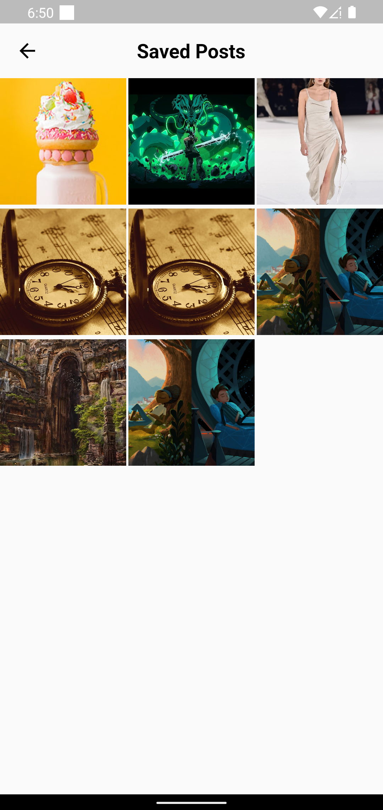

 
Figure 9: User like posts area
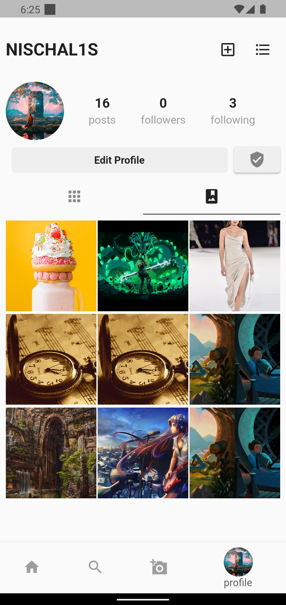

 
Figure 10: When you search User
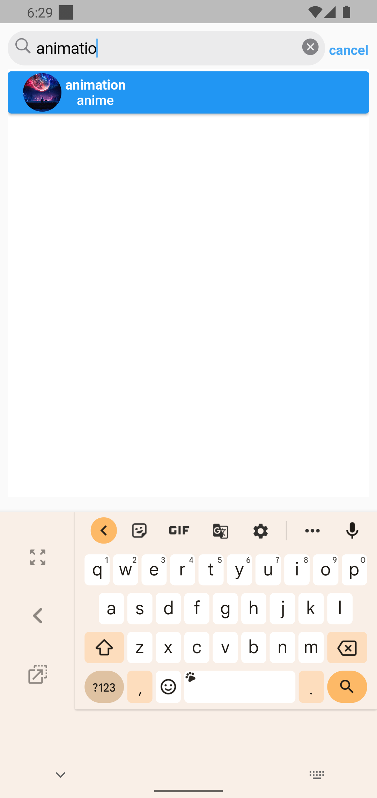

 
Figure 11:Explore Post
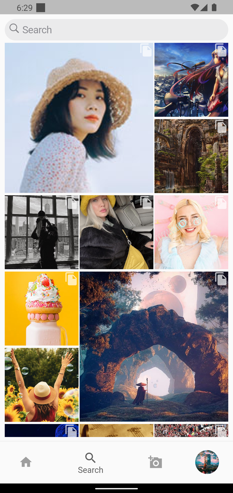

 
Figure 12: Image preview after selection Images to upload post
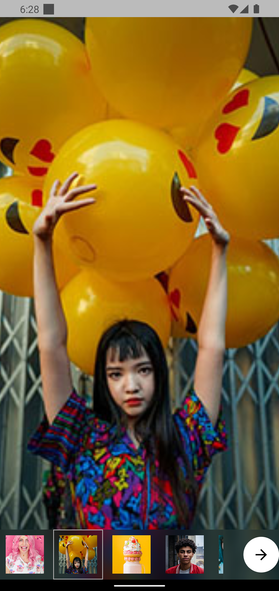

 
Figure 13: Add Post From
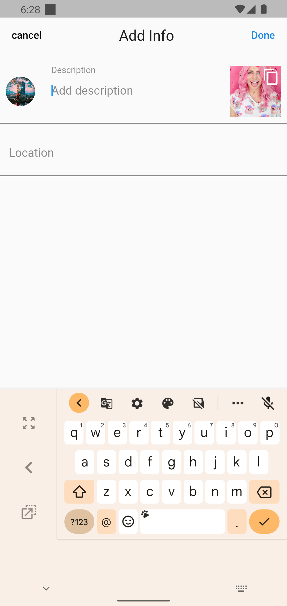

 
Figure 14: after you followed the user

 
Figure 15: Bottom Sheet Modal when click on hamburger icon
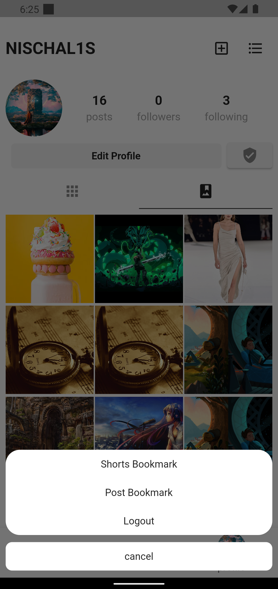

 
Figure 16: Image preview before uploading

 
Figure 17: Saved Post Screen

 
Figure 18: Saved Shorts Screen

 
Figure 19: Edit Profile Page
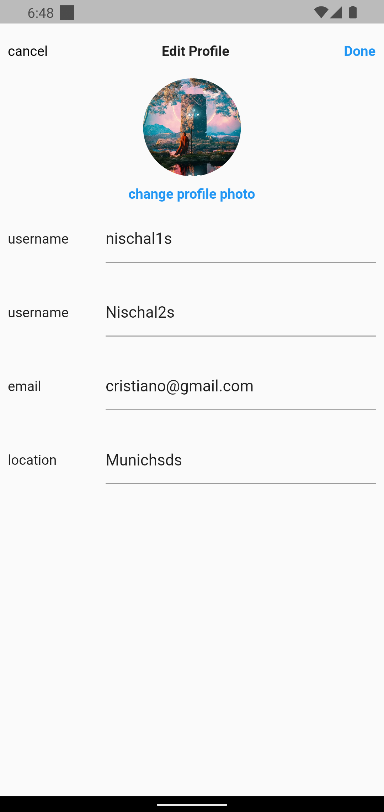

Figure 20: follower list of logged in user and other user
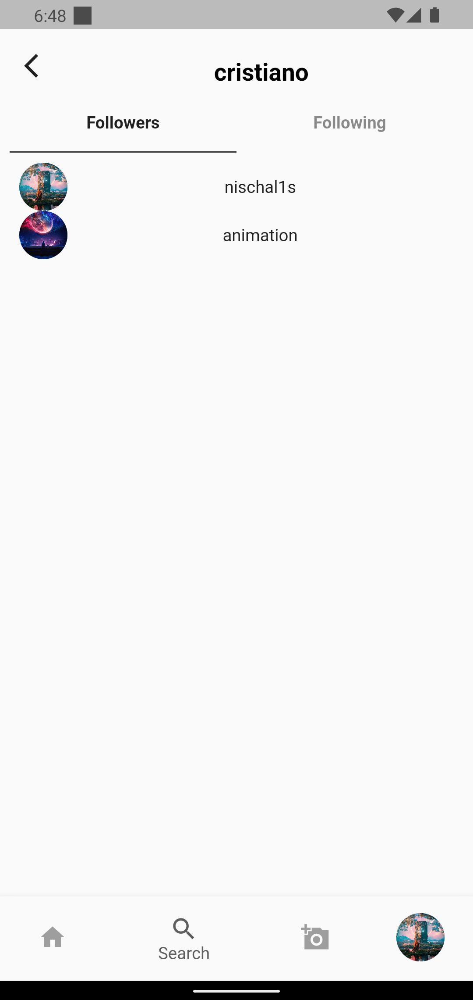 
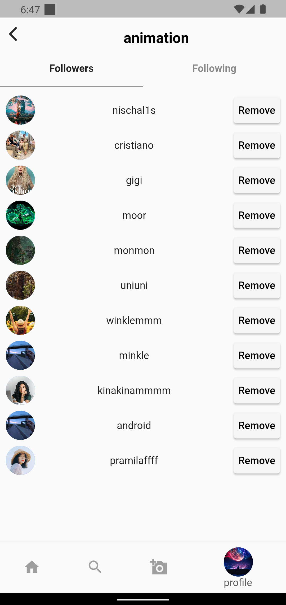

 
Figure 21: Following list of logged in user and other user 
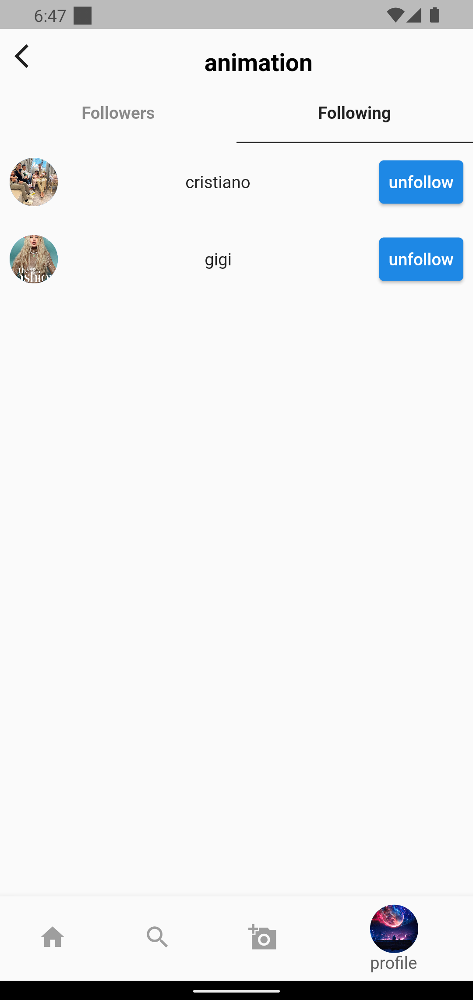
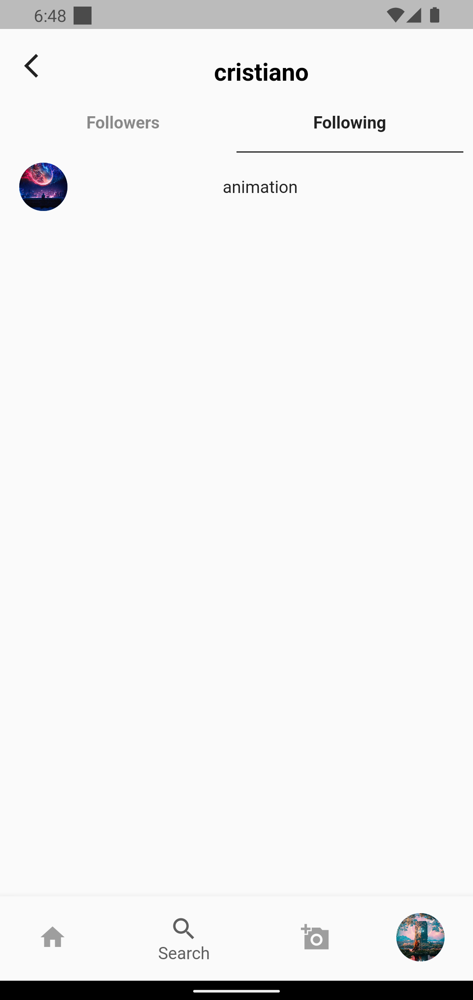

ScreenShorts

Challenges

Future Works
To change the theme of the application so that the user can set the theme of the app either in light or dark mode according to their preferences.

Report issues and block specific users or content to avoid unnecessary content.

Implementing chat and video calls so that users can contact each other.

Calculate the average time spent hours per day and notify the users that they have exceeded the maximum hours of time.

State Management

Project Architecture
In order to separate the program logic from the user interface controls, a software design pattern called Model-View-View Model (MVVM) is used. Model-view-binder, sometimes known as MVVM, was developed by Microsoft architects Ken Cooper and John Gossman.
Utilizing view models, the MVVM design pattern enhances the separation of concerns. Data from the model layer is converted by the view model into information that the view layer can use. MVVM has the advantage of improving the testability of view controllers. Due to the view controller's independence from the model layer, testing them is easier. Similar to this, the view model gives the view controller a transparent interface it may use to fill the view layer and interact with the model layer.

Conclusion
The engagement of people in social media has increased drastically around the world. Using Winkle app can help users to get involved in multiple groups and they can know the news around the world by the posts shared in that particular group. Furthermore, it can also be regarded as a source of entertainment and source of knowledge where user can go through funny videos as well as they can also like pages that shares quotes and content related to studies and all.

